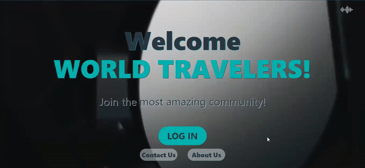
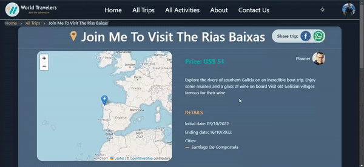

<a id="readme-top"></a>


[![Contributors][contributors-shield]][contributors-url]
[![Forks][forks-shield]][forks-url]
[![Stargazers][stars-shield]][stars-url]
[![Issues][issues-shield]][issues-url]
<!-- [![MIT License][license-shield]][license-url]
[![LinkedIn][linkedin-shield]][linkedin-url] -->


<!-- PROJECT LOGO -->
<br />
<div align="center">
  <a href="https://github.com/othneildrew/Best-README-Template">
    
  </a>

  <!-- <p align="center">
    An awesome README template to jumpstart your projects!
    <br />
    <a href="https://github.com/othneildrew/Best-README-Template"><strong>Explore the docs »</strong></a>
    <br />
    <br />
    <a href="https://github.com/othneildrew/Best-README-Template">View Demo</a>
    ·
    <a href="https://github.com/othneildrew/Best-README-Template/issues">Report Bug</a>
    ·
    <a href="https://github.com/othneildrew/Best-README-Template/issues">Request Feature</a>
  </p> -->
</div>


<!-- TABLE OF CONTENTS -->
<details>
  <summary>Table of Contents</summary>
  <ul>
    <li><a href="#about-the-project">About The Project</a></li>
    <li><a href="#built-with">Built With</a></li>
    <li><a href="#roadmap">Roadmap</a></li>
    <li><a href="#payments-accounts">Payments accounts</a></li>
    <li><a href="#enviroment-variables">Enviroments variables</a></li>
</details>


<!-- ABOUT THE PROJECT -->
# About The Project

<!-- [![Product Name Screen Shot][product-screenshot]](https://example.com) -->

Our project is called World Travelers. It is a single page application that allows users to create group trips by booking tourist activities in their favorite destinations or join trips created by other users. It has a payment gateway with two possible options: Paypal and web3. In addition, they can communicate with users who are part of the trip as it has a live chat. 💬

<p align="right">(<a href="#readme-top">back to top</a>)</p>


## Built With

The project was carried out with the following technologies


<!-- * [![Next][Next.js]][Next-url]
* [![React][React.js]][React-url]
* [![Vue][Vue.js]][Vue-url]
* [![Angular][Angular.io]][Angular-url]
* [![Svelte][Svelte.dev]][Svelte-url]
* [![Laravel][Laravel.com]][Laravel-url]
* [![Bootstrap][Bootstrap.com]][Bootstrap-url]
* [![JQuery][JQuery.com]][JQuery-url] -->

<p align="right">(<a href="#readme-top">back to top</a>)</p>


## Roadmap
<center>
<div><h1>Login</h1></div>
<br>
<div><h1>Home</h1></div>
<br>
<div><h1>Trip-detail</h1></div>
<br>
<div><h1>Payment with Paypal</h1></div>
<br>
<div><h1>Payment with web3</h1></div>
<br>
<div><h1>Chat of trip</h1></div>
<br>
<div><h1>Activity-detail</h1></div>
<br>
<div><h1>Admin dashboard</h1></div>
</center>


<p align="right">(<a href="#readme-top">back to top</a>)</p>


## Payments accounts

This is an example of how to list things you need to use the software and how to install them.
* Paypal trial accounts:
  ```sh
  Account 1
  mail: comprador_default@gmail.com
  password: 12345678

  Account 2
  mail: buyer-default@gmail.com
  password: 12345678

  Account 3
  mail: payments-test@gmail.com
  password: 12345678
  ```

* Payments with web 3:
  ```sh
  "Get your ether goerli tests in:" https://goerlifaucet.com/
  ```
  <p align="right">(<a href="#readme-top">back to top</a>)</p>

<!-- ## Installation

_Below is an example of how you can instruct your audience on installing and setting up your app. This template doesn't rely on any external dependencies or services._

1. Get a free API Key at [https://example.com](https://example.com)
2. Clone the repo
   ```sh
   git clone https://github.com/your_username_/Project-Name.git
   ```
3. Install NPM packages
   ```sh
   npm install
   ```
4. Enter your API in `config.js`
   ```js
   const API_KEY = 'ENTER YOUR API';
   ``` -->
<!-- 
<p align="right">(<a href="#readme-top">back to top</a>)</p> -->


<!-- USAGE EXAMPLES -->
## Enviroment variables

 You may set up this enviroments variables for running project in your local

* Eviroments variables:
  ```sh
  DATABASE_URL="postgresql://{USERNAME}:{PASSWORD}@{HOST}:{PORT}/{DATA BASE NAME}"
  MONGO_URI=mongodb+srv://{DATABASENAME}:{PASSWORD}@{HOST}/?retryWrites=true&w=majority
  AXIOS_URL_BASE="http://localhost:3000/api"
  ```

* Set up your own Auth0 config
  ```sh
  AUTH0_SECRET=
  AUTH0_BASE_URL='http://localhost:3000'
  AUTH0_ISSUER_BASE_URL=
  AUTH0_CLIENT_ID=
  ```

* Set up your own Cloudinary config
  ```sh
  CLOUDINARY_URL=cloudinary://{APIKEY}:{API-SECRET}@{NAME}
  CLOUDINARY_NAME=
  CLOUDINARY_API_KEY=
  CLOUDINARY_API_SECRET=
  <!-- Config your foulders with this names -->
  CLOUDINARY_PRESET_AVATARS=
  CLOUDINARY_PRESET_TRIPS=
  CLOUDINARY_PRESET_ACTIVITIES=
  ```
<!-- developer.paypal.com -->
* Set up your own [Paypal](https://developer.paypal.com/home) config
  ``` sh
  PAYPAL_API_CLIENT=
  PAYPAL_API_SECRET=
  PAYPAL_API=
  PAYPAL_URL='http://localhost:3000'
  ```
* Set up your own node-mailer config:
  ```sh
  MAIL_FROM=
  MAIL_PASSWORD=
  MAIL_BASE_URL="http://localhost:3000"
  ```


<p align="right">(<a href="#readme-top">back to top</a>)</p>


<!-- ROADMAP -->
<!-- ## Roadmap

- [x] Add Changelog
- [x] Add back to top links
- [ ] Add Additional Templates w/ Examples
- [ ] Add "components" document to easily copy & paste sections of the readme
- [ ] Multi-language Support
    - [ ] Chinese
    - [ ] Spanish

See the [open issues](https://github.com/othneildrew/Best-README-Template/issues) for a full list of proposed features (and known issues).

<p align="right">(<a href="#readme-top">back to top</a>)</p> -->


<!-- CONTRIBUTING -->


<!-- MARKDOWN LINKS & IMAGES -->
<!-- https://www.markdownguide.org/basic-syntax/#reference-style-links -->
[contributors-shield]: https://img.shields.io/github/contributors/AngelPM9506/PF-SoyHenry?style=for-the-badge
[contributors-url]: https://github.com/AngelPM9506/PF-SoyHenry/graphs/contributors
[forks-shield]: https://img.shields.io/github/forks/AngelPM9506/PF-SoyHenry?style=for-the-badge
[forks-url]: https://github.com/AngelPM9506/PF-SoyHenry/network/members
[stars-shield]: https://img.shields.io/github/stars/AngelPM9506/PF-SoyHenry?style=for-the-badge
[stars-url]: https://github.com/AngelPM9506/PF-SoyHenry/stargazers
[issues-shield]: https://img.shields.io/github/issues/AngelPM9506/PF-SoyHenry?style=for-the-badge
[issues-url]: https://github.com/AngelPM9506/PF-SoyHenry/issues
<!-- [license-shield]: https://img.shields.io/github/license/AngelPM9506/PF-SoyHenry?style=for-the-badge
[license-url]: https://github.com/othneildrew/Best-README-Template/blob/master/LICENSE.txt
[linkedin-shield]: https://img.shields.io/badge/-LinkedIn-black.svg?style=for-the-badge&logo=linkedin&colorB=555
[linkedin-url]: https://linkedin.com/in/othneildrew
[product-screenshot]: images/screenshot.png
[Next.js]: https://img.shields.io/badge/next.js-000000?style=for-the-badge&logo=nextdotjs&logoColor=white
[Next-url]: https://nextjs.org/
[React.js]: https://img.shields.io/badge/React-20232A?style=for-the-badge&logo=react&logoColor=61DAFB
[React-url]: https://reactjs.org/
[Vue.js]: https://img.shields.io/badge/node.js-black?style=for-the-badge&logo=node.js&logoColor=4FC08D
[Vue-url]: https://nodejs.org/es/
[Angular.io]: https://img.shields.io/badge/typescript-blue?style=for-the-badge&logo=typescript&logoColor=white
[Angular-url]: https://www.typescriptlang.org/
[Svelte.dev]: https://img.shields.io/badge/chakraui-4A4A55?style=for-the-badge&logo=chakraui&logoColor=lightblue
[Svelte-url]: https://chakra-ui.com/
[Laravel.com]: https://img.shields.io/badge/pos-FF2D20?style=for-the-badge&logo=laravel&logoColor=white
[Laravel-url]: https://laravel.com
[Bootstrap.com]: https://img.shields.io/badge/Bootstrap-563D7C?style=for-the-badge&logo=bootstrap&logoColor=white
[Bootstrap-url]: https://getbootstrap.com
[JQuery.com]: https://img.shields.io/badge/jQuery-0769AD?style=for-the-badge&logo=jquery&logoColor=white
[JQuery-url]: https://jquery.com  -->
